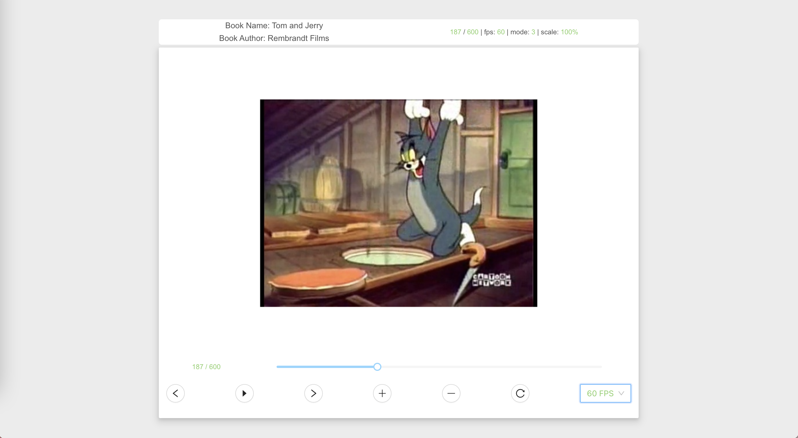

# Flip Book Player

> Author: Tao Ren
>
> Email: tar118@pitt.edu
>
> Linkedin: https://www.linkedin.com/in/taoren-pitt/

## Demo
[React FlipBook Player](https://drive.google.com/file/d/1mijHThI4Li6Ux6cgWWWhtFapIB3WWOIV/view?usp=sharing)

## How to run this project
1. Installs all the dependencies 

    `yarn`

2. Runs the app in the development mode.

    `yarn start`

## Additional Features
I have implemented all additional features.
1. A navigation bar that lets you jump to different parts of the flipbook.
2. Ability to customize the frame rate (10 fps, 30 fps, 60 fps).
3. Ability to zoom in/out and pan.
4. Multi-devices compatibility in style including laptop (Mac), PC, mobiles (iPhone SE, iPhone XR, iPhone 12 (Pro), iPhone 13 (Pro)) and tablet (iPad mini)
5. Implemented mode change: image DOM, canvas rendering

## Decisions, Tradeoff and Improvement

### 1. Ant Design and React Hooks

I use Ant Design to implement some components, like Slider, Button, Icon and Selector.
The reason is obvious, Ant Design is an enterprise-class UI design language and React UI library with a set of high-quality React components, one of best React UI library for enterprises.

All react components implmented by React Hooks.

Except Ant Design and React scaffold, I don't have any other dependencies.

### 2. Tradeoff
> How I improve the frame rate, from Naive to Preload to Canvas Rendering

Firstly, I implemented the player by naive image elements, and flipped the pictures by updating the source of image element, and obviously the frame rate can not reach 30.

Then, I tried to preload all image elements in loading process to support higher frame rate. 

After preloading, the frame rate can reach 30 and about 60. But it still may skip some frame if the browser can not afford. It is a kinds of heavy task for browser to delete and insert DOM elements in 60 fps.

So I decided to use canvas to render the pre-loaded images. I did some calculations to center, scale, pan the image on the canvas. Thanks to the canvas rendering, the frame rate is stable and the burden of rendering work is greatly reduced.

I considered the window of preloading, which only queries a window size of pictures with offset and count, but it seems like no window can also meet the requirements of this project. So I spent more time on other fancy features.

There are many tradeoff between canvas rendering performance and engineering complexity.

For example, I choose to use setInterval to control fps, rather than requestAnimationFrame. It's easy for fps switching and it is enough to play these pictures, but is not enough for more complex cases like HTML5 games.

I didn't implement multiple layered canvases to improve the fps after considering the spent time and improved performance.

As for diff rendering, it's too technical in computer graphic for this frontend project. If that's what this project asked, then I'm wrong. :\<

#### 2.1 Further

Like I said, there still are many tricks to improve the frame rate, like requestAnimationFrame, hidden canvas preload, multiple layered canvases, redraw differently only.

Considering the tradeoff between engineering complexity and performance, I didn't go deep in these tricks.

### 3. Component Design and Decoupling

In order to improve maintainability and decoupling, I split the Flipbook into three parts: **FlipHeader**, **FlipPage**, and **FlipController**.

FlipHeader provides some basic text infomation about the book.

FlipPage will choose one of three components with different implementations according to the selected mode: **FlipPageNaive**, **FlipPagePreload**, **FlipPageCanvas**, which implemented by source updating, preloading and canvas updating.

FlipControler contains all operators like play/pause buttons and process bar, fps selector, zoom in/out/pan.

I separate the data class from the component state to better develop. In class BookInfo, there are all infomation about a flipbook But I didn't use redux to manage the component state. I use traditionally way to update state between parent component and children components, transmiting the callback function as props. 

Besides, I use a state updateFlag to manaully update the children components to solve the object state change problem, which is also the problem solved by immutable.js (I don't want to import other deps).

I use an instance of BookInfo dataclass as the state of FlipBook, and the changes in this instance can not be watched by components. That's why I use this flag to update. 

There is a FlipContainer to control invoking APIs for resources query and instance initialization. It won't be re-rendered after the initialization. I hide the mode switch, because I found after preloading, the effects of different modes are difficult to distinguish by observation. The default mode is 3, which loads FlipPageCanvas. If you are interested in the bad performance under the other 2 modes, you can change the mode in code.

### 4. Debounce for progress bar

I noticed there is frame flicking when moving progress bar, so I provide a debounce setPage for progress bar. The changes from progress bar will have 500ms latency time to avoid to update too frequently.
For next page and previous page button, they sitll update the page state immediately.

## Available Scripts

In the project directory, you can run:

### `yarn`

Installs all the dependencies for the app.

### `yarn start`

Runs the app in the development mode.\
Open [http://localhost:3000](http://localhost:3000) to view it in the browser.

The page will reload if you make edits.\
You will also see any lint errors in the console.

### `yarn build`

Builds the app for production to the `build` folder.\
It correctly bundles React in production mode and optimizes the build for the best performance.

The build is minified and the filenames include the hashes.\
Your app is ready to be deployed!

See the section about [deployment](https://facebook.github.io/create-react-app/docs/deployment) for more information.

## Tool

I also implemented a python script based on python-opencv to convert a video to images. These images can be placed under `server/public/assets/videos/video*/`.

